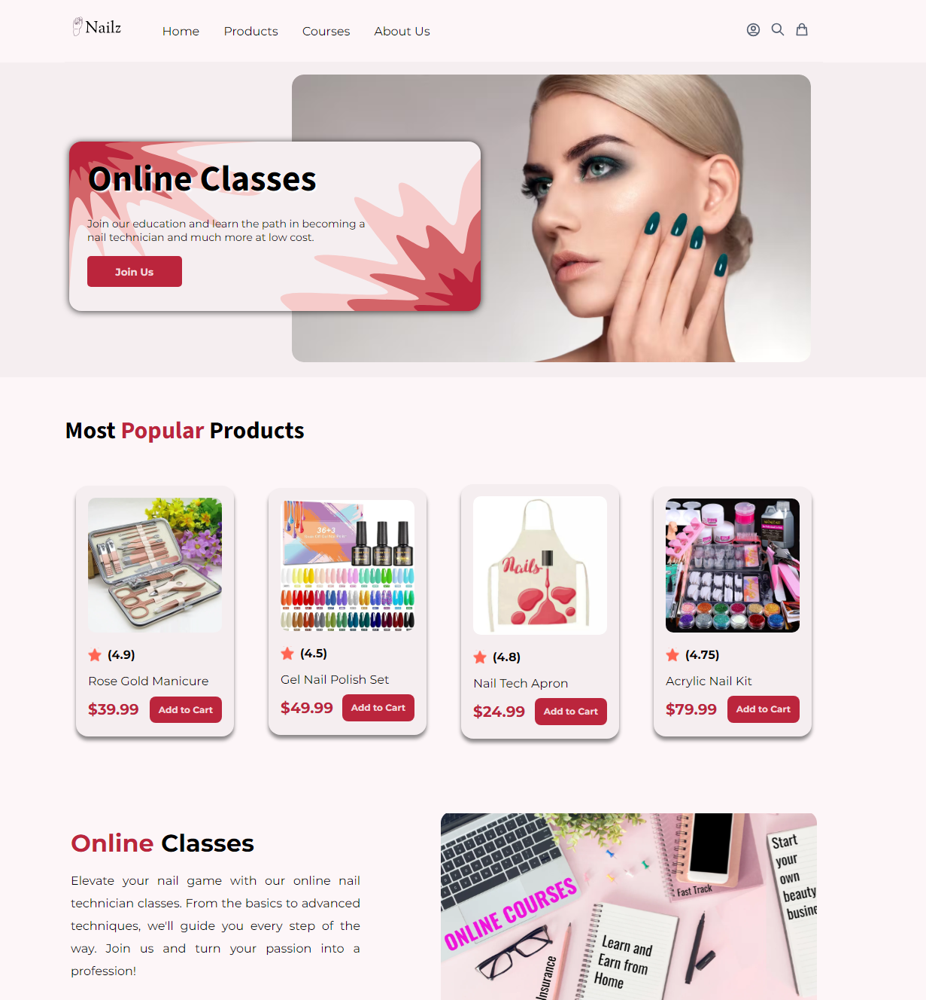

# Nailz: Your Ultimate Nail Beauty and Education Hub

Welcome to the Nailz README, your comprehensive guide to our e-commerce platform specializing in nail products and nail art courses. Explore our offerings, discover your inner nail artist, and embark on a journey to nail perfection with us!

## Table of contents

- [Overview](#overview)
  - [The challenge](#the-challenge)
  - [Screenshot](#screenshot)
  - [Links](#links)
- [My process](#my-process)
  - [Built with](#built-with)
  - [What I learned](#what-i-learned)
  - [Continued development](#continued-development)
  - [Useful resources](#useful-resources)
- [Author](#author)

## Overview

Welcome to Nailz, a solo frontend project dedicated to the world of nail beauty and education. This project is a personal endeavor to create a captivating and user-friendly e-commerce website that focuses exclusively on nail products and online/offline nail art courses.

### The challenge

Users should be able to: 
- View the optimal layout for the app depending on their device's screen size
- See hover states for all interactive elements on the page
- Be able to navigate to different pages
- Add items to the Cart
- Remove items from the Cart
- and more

### Screenshot

- Desktop Screenshots

  

